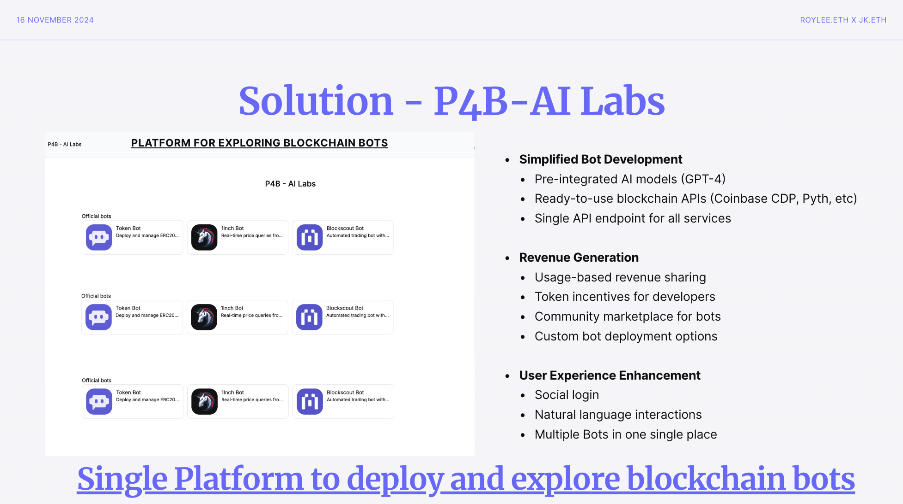

## P4B-AI Labs

P4B-AI Labs is revolutionizing the blockchain bot ecosystem by addressing three critical market gaps:

### Key Problems Solved:
1. **Fragmented Development Landscape**
   - Complex integrations between AI models and blockchain
   - High costs of multiple API subscriptions
   - Time-consuming setup processes

2. **Developer Monetization**
   - Uncertain revenue paths for Web3 AI applications
   - Lack of centralized marketplace
   - High entry barriers for builders

3. **User Accessibility**
   - Complex wallet connections
   - Scattered bot ecosystem
   - Technical barriers for non-crypto users

### Core Features:
- **Unified Bot Platform**
  - Pre-integrated AI models (GPT-4 and more)
  - Ready-to-use blockchain APIs (Coinbase CDP, Pyth Network, The Graph, Blockcust, etc)

- **Revenue Generation System**
  - Token staking mechanism for usage
  - Fair revenue sharing for bot creators
  - Community-driven marketplace

- **Seamless User Experience**
  - Social media login integration
  - Natural language interactions
  - Multiple bots in one platform

## How it's Made

### Technical Infrastructure:
1. **Authentication & Access**
   - Social login integration
   - Smart contract-based revenue sharing

2. **Core Integrations**
   - Coinbase CDP SDK for blockchain functionality
   - Custom Solidity smart contracts for revenue distribution
   - Langchain for AI agent orchestration

3. **Data Sources**
   - Coinbase CDP for market data
   - Pyth Network for price feeds
   - Blockscout APIs for transaction data
   - The Graph for customized on-chain queries

4. **Development Tools**
   - Coinbase CDPAgent Kit for autonomous AI agents
   - Custom-built agent management system

## Future Thoughts

### Short-term Development:
1. **Developer Empowerment**
   - Self-service agent creation platform
   - Extended API connectivity options
   - Simplified development toolkit

2. **Enhanced Revenue Model**
   - Capability-based rewards system
   - Incentives for infrastructure contributions
   - Advanced staking mechanisms

3. **Technical Enhancements**
   - Smart wallet integration via agent interface
   - Resolution of CDPSDK and Agent Kit wallet seed alignment
   - Advanced alert system implementation

### Long-term Vision:
1. **Ecosystem Expansion**
   - Additional AI model integrations
   - Expanded blockchain API partnerships
   - Cross-chain functionality

2. **Platform Evolution**
   - Advanced bot marketplace features
   - Enhanced analytics and monitoring
   - Automated bot optimization tools

3. **User Experience Innovation**
   - Proactive alert systems
   - Enhanced social features
   - Advanced interaction capabilities

## Deployment

### Contract

- Bot Factory [`0xAfa9CdC683045f23990A7d4Aaf5D8C41C6881796`](https://base-sepolia.blockscout.com/address/0xAfa9CdC683045f23990A7d4Aaf5D8C41C6881796)
- Bot Registry 01 [`0x35ecdd896863c6670401a01c6dc5e2ca047e3026`](https://base-sepolia.blockscout.com/address/0x35ecdd896863c6670401a01c6dc5e2ca047e3026)
- Bot Registry 02 [`0x48d38ad2dc3b221f0b00d1a90e0ec97c3da75425`](https://base-sepolia.blockscout.com/address/0x48d38ad2dc3b221f0b00d1a90e0ec97c3da75425)
- Bot Registry 03 [`0x771bf60b933d572cdc79e88ddb3b45799860e7e7`](https://base-sepolia.blockscout.com/address/0x771bf60b933d572cdc79e88ddb3b45799860e7e7)
- Bot Registry 04 [`0x91881d427bb9dfdcce2424bc7df9b2c184fcd59a`](https://base-sepolia.blockscout.com/address/0x91881d427bb9dfdcce2424bc7df9b2c184fcd59a)

### Subgraph

- **API Endpoint:** `https://api.studio.thegraph.com/query/25032/ethglobal/version/latest`

